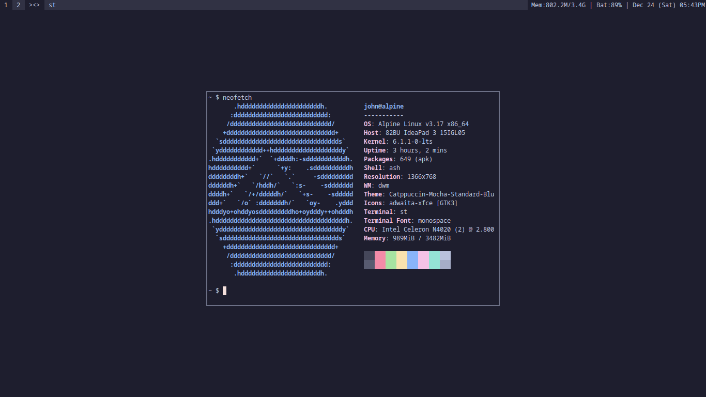

### Sobre  
Esse repositório se trata de uma coletânea completa de todas as  
ferramentas suckless que utilizo. O que estou tentando  
é uma espécie de "Desktop Enviroment" utilizando essa ferramentas  
e outras que eu encontrar também.  

A paleta de cores utilizada é a [Catppuccin](https://github.com/catppuccin/catppuccin), com cores mais monocromáticas.

### ATENÇÃO
O script "instalar.sh" foi feito para ser utilizado no [Alpine Linux](https://alpinelinux.org).  
Caso você queira utilizá-lo, terá de adapta-lo à sua distribuição de preferência.  

