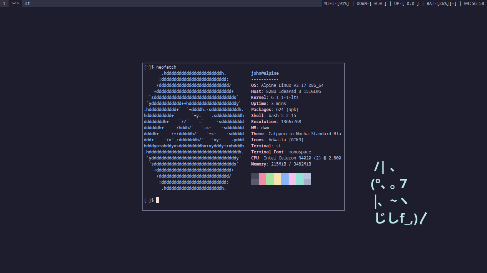

### Sobre  
Esse repositório se trata de uma coletânea completa de todas as  
ferramentas suckless que utilizo. O que estou tentando  
fazer é uma espécie de "Desktop Enviroment"   
utilizando essa ferramentas e outras que eu encontrar também.  

A paleta de cores utilizada é a [Catppuccin](https://github.com/catppuccin/catppuccin), com cores mais monocromáticas.

### ATENÇÃO
O script "instalar.sh" foi feito para ser utilizado no [Alpine Linux](https://alpinelinux.org).  
Caso você queira utilizá-lo, terá de adapta-lo à sua distribuição de preferência.  

### Teclas de atalho  

#### DWM  
As teclas de atalho do dwm só as teclas de atalho padrão, com a  
adição de 7 novas:

- `MOD + w` = Executa o script `web`  
- `MOD + e` = Executa o script `dfm`  
- `MOD + s` = Executa o script `passmenu`  
- `MOD + d` = Executa o script `todo`  
- `PrtSc` 	= Executa o script `screenshot`  
- `MOD + a` = Executa o `alsamixer`  
- `MOD + c` = Executa o `cmus`  

#### ST  
As teclas de atalho do st só as teclas de atalho padrão, com a  
alteração de 2:  

- `Alt + c` = Cola o conteúdo da clipboard  
- `Alt + v` = Copia a selação para a clipboard  

#### SURF  

- `Esc` = Para o carregamento da página  
- `F1`  = Retrocede uma página  
- `F2`  = Avança uma página  
- `F5`  = Recarrega a página  
- `F11`  = Página em tela cheia  
- `F12`  = Ativa o inspetor de página  
- `Crtl + i` = Zoom+  
- `Crtl + o` = Zoom-  
- `Crtl + 0` = Reseta o zoom  
- `Crtl + p` = Imprime a tela  
- `Crtl + t` = Mostra o certificado da página  
- `Crtl + Shift + a` = Troca a política de cookies  
- `Crtl + s` = Ativa/desativa o javascript  
- `Crtl + d` = Ativa/desativa o css customizado  
- `Crtl + u` = Copia a url para a clipboard  
- `Crtl + Shift + u` = Acessa a url copiada na clipboard  
- `Crtl + g` = Abre a barra de url  
- `Crtl + f` = Abre a barra de busca por texto na página  

### Preview  

